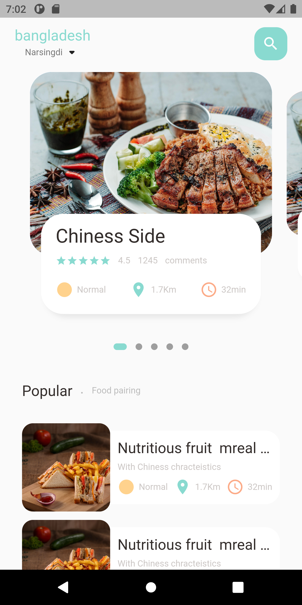
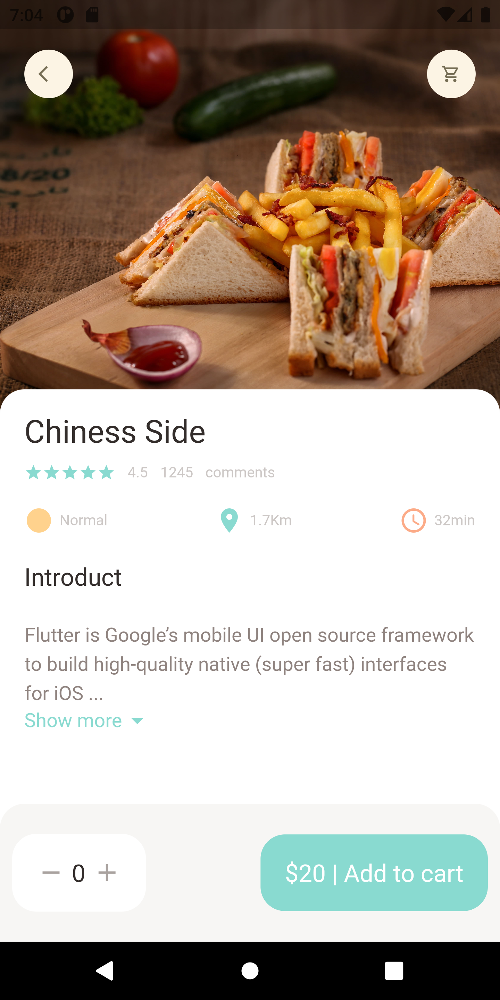
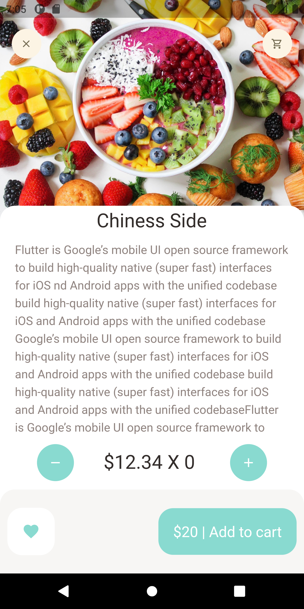

&nbsp;&nbsp;
&nbsp;&nbsp;
<a href="https://choosealicense.com/licenses/mit/" target="_blank"></a>&nbsp;&nbsp;
&nbsp;&nbsp;


# food_app

A new Flutter project.

This project is a starting point for a Flutter application.

A few resources to get you started if this is your first Flutter project:

- [Lab: Write your first Flutter app](https://docs.flutter.dev/get-started/codelab)
- [Cookbook: Useful Flutter samples](https://docs.flutter.dev/cookbook)

For help getting started with Flutter development, view the
[online documentation](https://docs.flutter.dev/), which offers tutorials,
samples, guidance on mobile development, and a full API reference.


## App screen 





## Directory
```dart
lib
 |-- models
 |-- screens
 |   |-- splash_screen.dart 
 |   |-- home_screen.dart 
 |   |-- login_screen.dart 
 |   |-- singin_screen.dart 
 |   |-- home_screen.dart 
 |-- utils
 |   |-- apps_color.dart 
 |   |-- apps_color.dart 
 |-- widgets
 |-- main.dart 

```